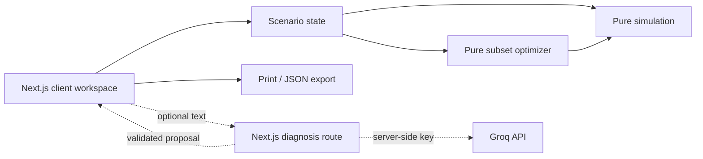

# JalSaarthi X

**Reviving India's Traditional Water Intelligence Through Modern Engineering and AI.**

Documentation-first blueprint for **PARAMPARA TO PROTOTYPE — DESIGN HACKATHON**, under the theme *Indian Knowledge Systems and Indigenous Innovation: Technology, Sustainability and Engineering for Viksit Bharat*.

> Status: specification only. The application, tests, and deployment described below are planned; no working implementation is claimed.

## Problem and approach

Traditional irrigation tanks and their supply or surplus channels can form connected systems. A damaged channel can prevent water from reaching downstream users. Deciding which connection to restore under a limited budget requires considering the whole network. JalSaarthi X proposes an Eri-inspired, **illustrative** digital tank cascade: users break a link, run a deterministic water balance, compare downstream demand, and search feasible repair combinations. This counterfactual restoration workflow is the **Parampara Recovery Engine**.

The Eri connection is architectural inspiration, not a claim that the demo represents a surveyed village. Tamil Nadu's Water Resources Department maintains a tank inventory; a [peer-reviewed Mailam cascade study](https://www.frontiersin.org/journals/water/articles/10.3389/frwa.2025.1597293/full) describes interconnected tanks and degraded infrastructure. [Tamil Nadu's channel-maintenance order](https://www.tnagrisnet.tn.gov.in/fcms/documents/go/agri_e_ms_87_ae2_2023.pdf) discusses obstructions and tail-end delivery. Sources and the separation between evidence and demo assumptions are in [the overview](documentation/01-PROJECT-OVERVIEW.md).

## Planned MVP

- One ready-to-run, four-tank, directed cascade with selectable tanks, channels, and village demand.
- One-step, integer-litre water balance with runoff, storage, channel transfer/loss, overflow, and unmet demand.
- Break/repair comparison, exhaustive budget-constrained repair search, and a household-first allocation toggle.
- Manual defect form; optional Groq extraction as a **proposal requiring confirmation**.
- Printable scenario report or downloaded JSON containing computed results and assumptions.

No sensors, live rainfall feed, field-validated costs, chatbot, mandatory login, database, or professional hydraulic claim.

## How the planned demo works

Open `/`, where the demo village loads immediately. Run the intact baseline, block channel **B→C**, and rerun. The illustrative fixture in [data models](documentation/05-DATA-MODELS.md) is designed to show 1,500 L delivered when intact and 500 L when that channel is blocked; these are **specification test expectations**, not measured savings. Enter ₹12,000, run the optimizer, inspect its recommendation, apply the repair, and compare actual engine results. Explain the source assumptions on `/parampara` and the limits on `/about`.

## Technology and architecture

Next.js App Router, TypeScript, Tailwind CSS, selective shadcn/ui, Lucide React, restrained Framer Motion, `@xyflow/react`, typed JSON fixture, Zod, Vitest, and **Vercel or Render**. React state is sufficient. Pure TypeScript simulation and optimization run in the browser; a single optional Next.js route protects the Groq key. See [tech stack](documentation/TECH-STACK.md) and [backend boundary](documentation/BACKEND.md).

Planned folders: `src/app/{page.tsx,parampara/page.tsx,about/page.tsx,api/diagnose/route.ts}`, `src/components/{workspace,network,results,report}`, `src/lib/{model,simulation,optimization,validation,fixture}`, and `src/lib/**/*.test.ts`. See [architecture](documentation/03-SYSTEM-ARCHITECTURE.md) for contracts.

## Implementation setup (after code exists)

Use a current supported Node.js LTS and npm. In the eventual Next.js project, install dependencies with `npm ci`, start with `npm run dev`, test with `npm run test`, and verify with `npm run build`. These commands become available when the [implementation plan](documentation/09-IMPLEMENTATION-PLAN.md) is executed and `package.json`/lockfile exist. The app must work without an AI key. For optional diagnosis, set `GROQ_API_KEY` in `.env.local` and in the chosen host's server environment; never expose it through a `NEXT_PUBLIC_` variable. Use `GROQ_MODEL=openai/gpt-oss-20b` as the documented starting model and verify its availability before release. Deploy the **implemented app** as a Next.js project to Vercel or as a Node web service to Render, then perform the [deployment smoke tests](documentation/11-DEPLOYMENT.md). This documentation-only repository cannot yet be deployed as an application. No URL or credential is supplied here.

## Documentation index

| Document | Purpose |
| --- | --- |
| [01 Project overview](documentation/01-PROJECT-OVERVIEW.md) | Problem, Eri grounding, scope |
| [02 Product requirements](documentation/02-PRODUCT-REQUIREMENTS.md) | Testable behavior and completion criteria |
| [03 System architecture](documentation/03-SYSTEM-ARCHITECTURE.md) | Boundaries and data flow |
| [04 Frontend UI/UX](documentation/04-FRONTEND-UI-UX.md) | Layout, states, accessibility |
| [05 Data models](documentation/05-DATA-MODELS.md) | Types, validation, illustrative fixture |
| [06 Simulation engine](documentation/06-SIMULATION-ENGINE.md) | Water-balance algorithm |
| [07 Repair optimization](documentation/07-REPAIR-OPTIMIZATION.md) | Budget search and ranking |
| [08 AI integration](documentation/08-AI-INTEGRATION.md) | Optional validated extraction |
| [09 Implementation plan](documentation/09-IMPLEMENTATION-PLAN.md) | Five-hour build order |
| [10 Testing and validation](documentation/10-TESTING-AND-VALIDATION.md) | Numerical and interaction checks |
| [11 Deployment](documentation/11-DEPLOYMENT.md) | Vercel and Render release paths |
| [12 Demo and pitch](documentation/12-DEMO-AND-PITCH.md) | Judge-facing walkthrough |
| [Tech stack](documentation/TECH-STACK.md) | Technology decisions and versions |
| [Backend](documentation/BACKEND.md) | Next.js server route and security boundary |

## Roadmap after MVP

Only after field data and expert review: calibrated multi-period modelling, GIS import, uncertainty intervals, and locally agreed water-sharing rules. Johads, khadins, tankas, and baolis require distinct models; they are educational context, not interchangeable engine presets.
