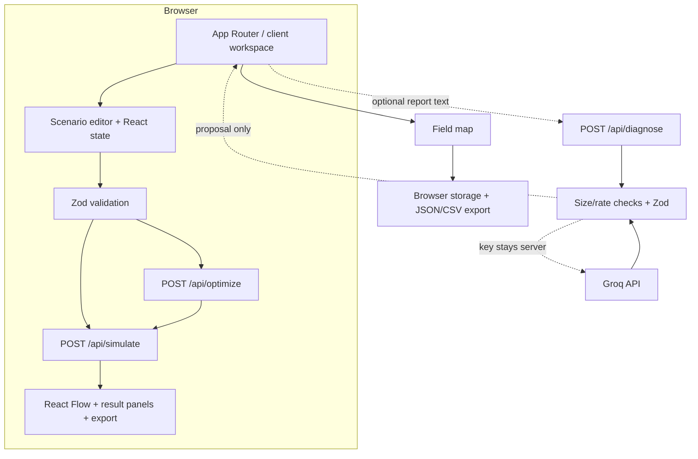

# 03 — System architecture

[Requirements](02-PRODUCT-REQUIREMENTS.md) · [Models](05-DATA-MODELS.md) · [AI boundary](08-AI-INTEGRATION.md)

## One application, explicit boundaries

`src/lib/simulation.ts` and `optimization.ts` have no React, network, clock, random, or mutable global state. `simulate(input)` receives a validated immutable snapshot and returns a new result. `optimize(input,budgetINR)` clones candidate scenario states, calls `simulate`, and returns ranked IDs and result. `src/lib/validation.ts` owns schemas and graph checks. UI components receive typed values and callbacks. The selected React Flow element is a UI selection, not domain state.

## Client state and invocation

Workspace state includes the editable scenario, selected element, last committed run, comparison snapshot, recommendation, and diagnosis draft. **Run** and **Optimize** send snapshots to same-origin API routes, which validate input before running the shared deterministic engine. Any edit marks results stale. Map data uses a separate browser-storage contract and does not silently become simulation input.

## Server boundary

`/api/diagnose` accepts a bounded narrative, calls Groq using a server-only `GROQ_API_KEY`, validates structured output, and returns an **unconfirmed proposal**. `/api/simulate` and `/api/optimize` validate bounded requests and run the deterministic engine on the server. No route accepts AI-produced flow, capacity, cost, or efficiency as authoritative. The `/map` page stores user-supplied records in browser storage; it has no database or user account. See [Backend](BACKEND.md) and [Field map](13-FIELD-MAP-AND-DATA.md).

## Data flow, errors, security

Scenario JSON → Zod parse + cross-reference/DAG check → edit snapshot → bounded API request → pure run or subset search → React presentation → local export. Map records include a user-entered source and stay in browser storage. Login or database persistence is not included; cross-device sync needs authenticated storage.

## Planned source boundaries

| Area | Owns | Must not own |
| --- | --- | --- |
| `src/lib/model.ts` + `validation.ts` | Types, Zod, graph checks | UI rendering |
| `src/lib/fixture.ts` | One illustrative scenario | live data |
| `src/lib/simulation.ts` | Deterministic water balance | provider calls, UI state |
| `src/lib/optimization.ts` | Repair subset enumeration and tie breaks | mutation of input |
| `src/components/workspace/*` | Forms, controls, orchestration | alternative calculations |
| `src/components/network/*` | React Flow projection and selection | domain storage state |
| `src/app/api/diagnose/route.ts` | Optional extraction proxy | simulation or writes |

See [the build schedule](09-IMPLEMENTATION-PLAN.md) for integration checkpoints.
